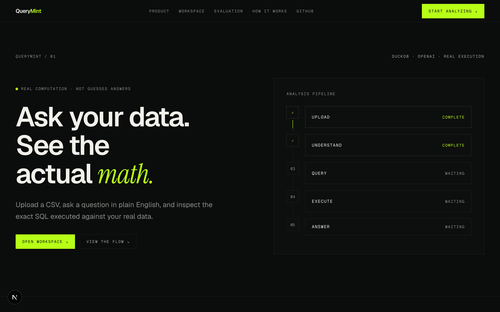
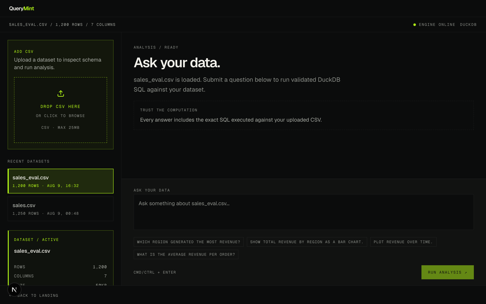
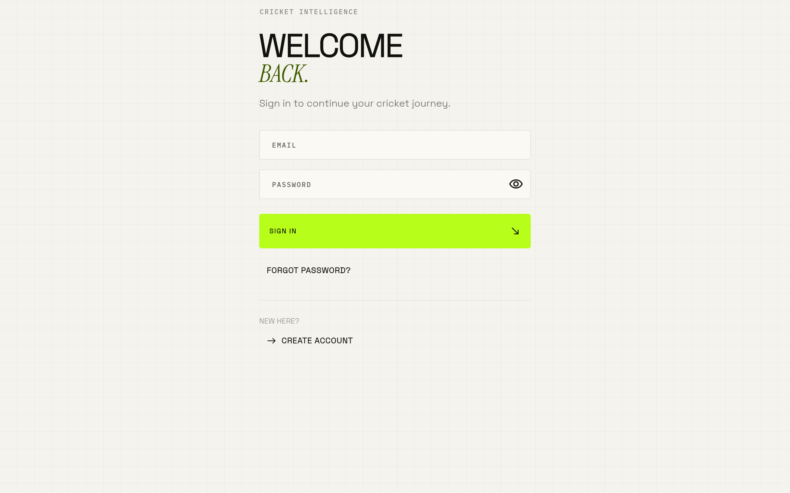
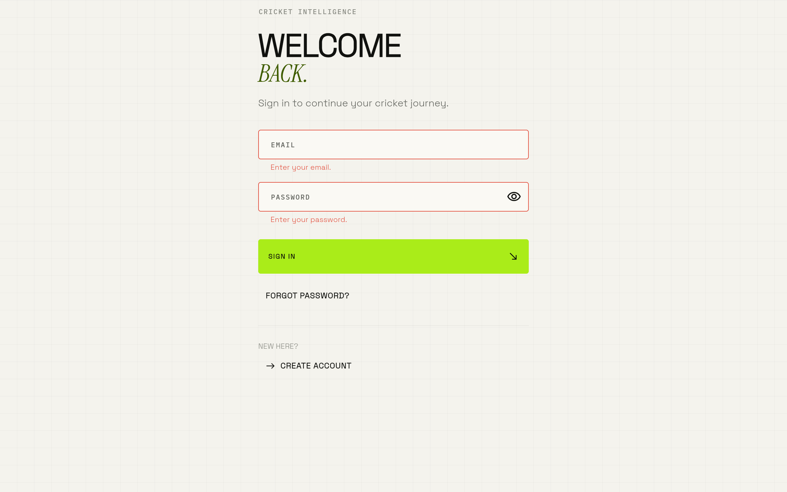
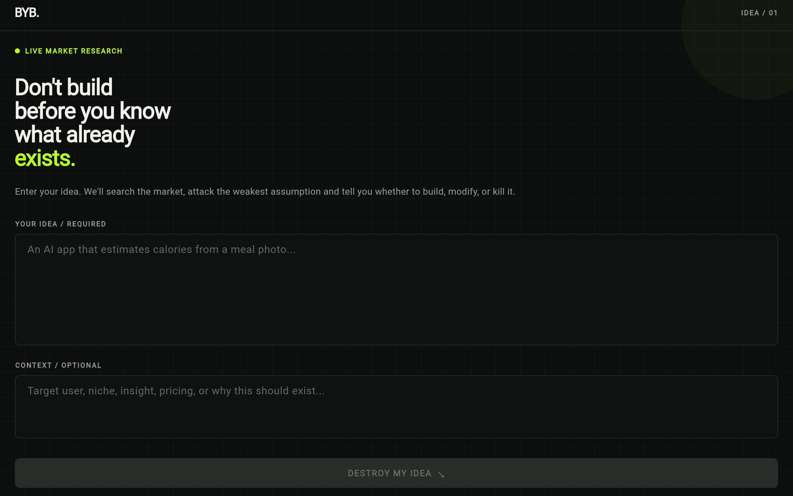
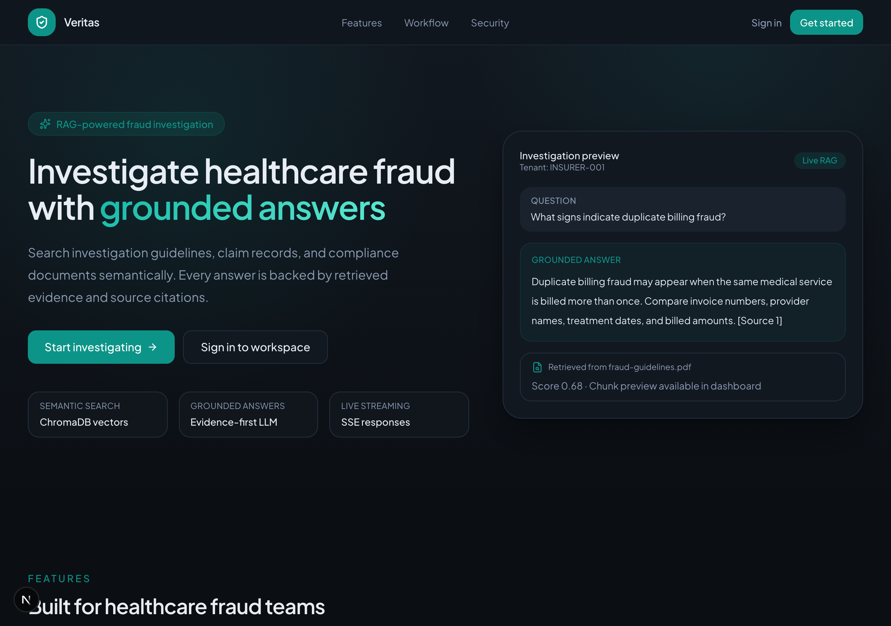
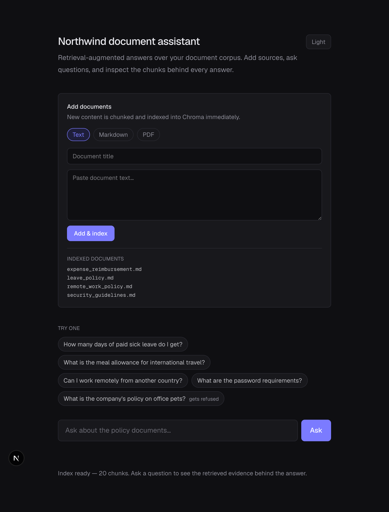
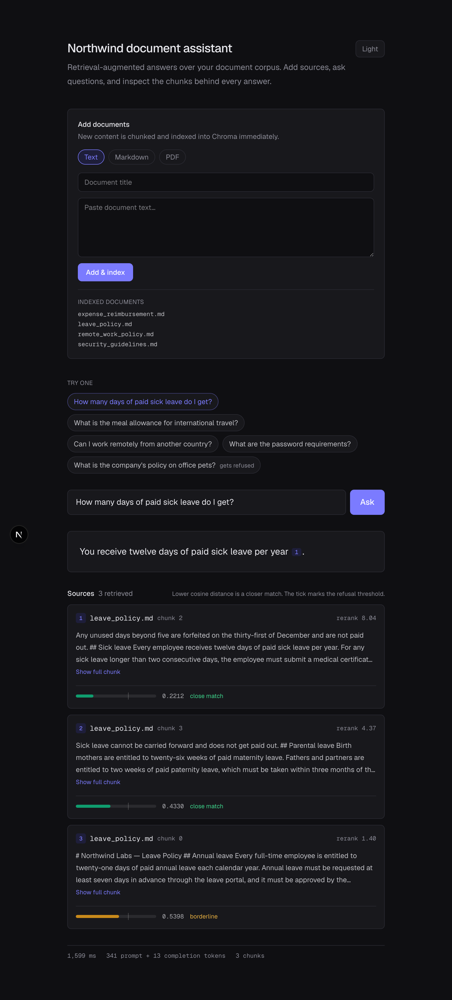
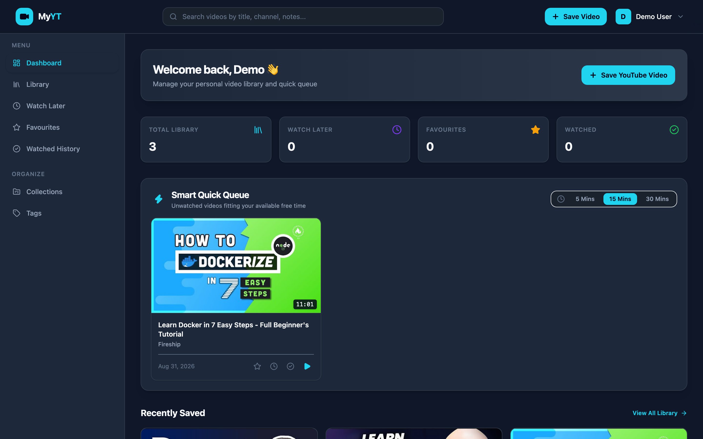
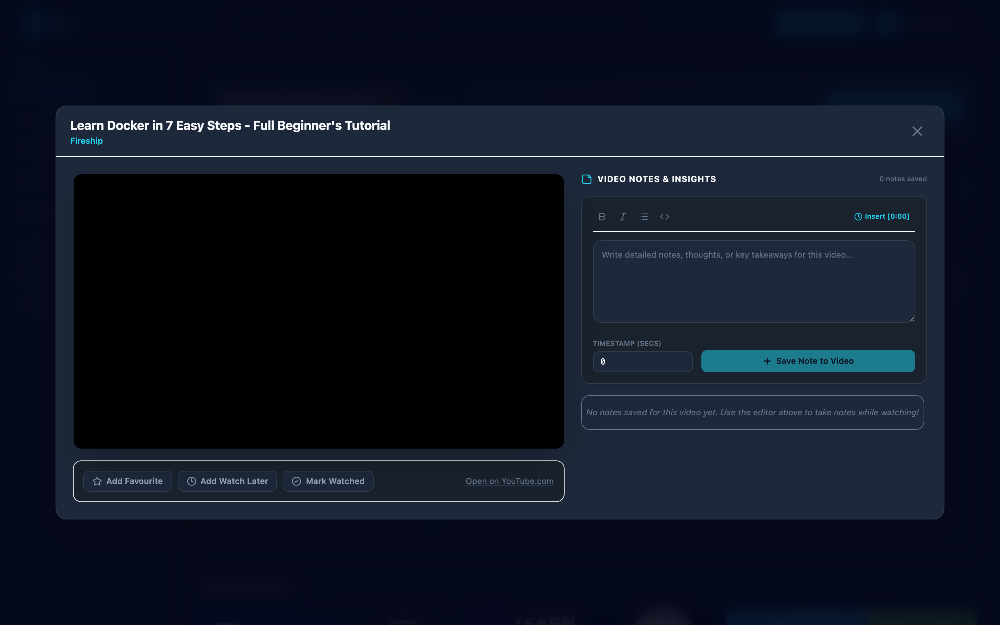

# 🚀 AI & Full-Stack Engineering Projects — Master Portfolio

Welcome to the **AI & Full-Stack Engineering Projects** repository! This monorepo features **8 production-grade AI applications, RAG systems, data analysis platforms, and full-stack web/mobile applications**.

Each project is self-contained with its own architecture, backend API, frontend interface, and dedicated git branch.

---

## 📚 Table of Contents

1. [Projects Overview](#-projects-overview)
   - [1. QueryMint — AI Data Analyst (`ai-data-analyst`)](#1-querymint--ai-data-analyst)
   - [2. AI Engineer Editorial Portfolio (`ai-engineer-portfolio`)](#2-ai-engineer-editorial-portfolio)
   - [3. Cricket Intelligence (`ai_cric_scoring`)](#3-cricket-intelligence)
   - [4. BeforeYouBuild (`before_you_build`)](#4-beforeyoubuild)
   - [5. Healthcare Fraud RAG API (`fraud-detection-rag`)](#5-healthcare-fraud-rag-api)
   - [6. Habit Tracker (`habit-tracker`)](#6-habit-tracker)
   - [7. Northwind RAG — Smart Document Assistant (`northwind-rag`)](#7-northwind-rag--smart-document-assistant)
   - [8. YouTube Playlist Manager (`my-yt-playlist`)](#8-youtube-playlist-manager)
2. [🌿 Git Branching Strategy](#-git-branching-strategy)
3. [⚡ Quick Start Guide](#-quick-start-guide)

---

## 🛠 Projects Overview

### 1. QueryMint — AI Data Analyst
> **Path:** [`ai-data-analyst/`](./ai-data-analyst) | **Branch:** `ai-data-analyst`  
> **Tech Stack:** FastAPI, Next.js 15, DuckDB, OpenAI API, Plotly.js, Tailwind CSS

An AI-powered data analytics and business intelligence platform. Users can upload CSV datasets, inspect schemas automatically, execute natural-language questions converted into high-performance DuckDB SQL via OpenAI tool calling, and view dynamic Plotly chart visualizations.

|  |  |
|---|---|
| **Landing Hero & Architecture Overview** | **Interactive Dataset Workspace & Profiling** |

---

### 2. AI Engineer Editorial Portfolio
> **Path:** [`ai-engineer-portfolio/`](./ai-engineer-portfolio) | **Branch:** `ai-engineer-portfolio`  
> **Tech Stack:** Next.js 15 (App Router), TypeScript, Tailwind CSS v4, Framer Motion, Lucide React

An editorial, brutalist dark portfolio site engineered specifically for an AI Engineer. Features near-black `#0a0a0a` theme with acid-lime `#c8ff32` accents, live typewriter status, system map architecture animations, interactive project case studies, and automated contact handling.

|  |  |
|---|---|
| **Brutalist Hero with Live IST Clock & Status** | **Inverted Paper-Toned Projects Showcase** |

---

### 3. Cricket Intelligence
> **Path:** [`ai_cric_scoring/`](./ai_cric_scoring) | **Branch:** `ai-cric-scoring`  
> **Tech Stack:** FastAPI, Flutter Web/Mobile, PostgreSQL, Riverpod, OpenAI API

AI-powered cricket scoring engine and match intelligence platform. Uses a pure deterministic scoring engine and auditable ball event stream for match management, coupled with LLM match analysis to generate grounded player insights without altering official stats.

|  |  |
|---|---|
| **Match Dashboard & Fixtures List** | **Deterministic Scoring Interface & Ball Event Stream** |

---

### 4. BeforeYouBuild
> **Path:** [`before_you_build/`](./before_you_build) | **Branch:** `before-you-build`  
> **Tech Stack:** FastAPI, Flutter Web/Mobile, OpenAI Responses API (Web Search), Pydantic v2

Helps startup founders validate whether an app idea is worth building. Performs live competitor web research via OpenAI web search, challenges weak positioning assumptions, and outputs a structured decision verdict (`BUILD | MODIFY | KILL`) along with a recommended initial MVP wedge.

|  |  |
|---|---|
| **Founder Idea Prompt & Context Input** | **BUILD / MODIFY / KILL Structured Verdict** |

---

### 5. Healthcare Fraud RAG API
> **Path:** [`fraud-detection-rag/`](./fraud-detection-rag) | **Branch:** `fraud-detection-rag`  
> **Tech Stack:** FastAPI, Next.js, ChromaDB, Sentence Transformers, Server-Sent Events (SSE), OpenAI

A production-style Retrieval-Augmented Generation (RAG) backend tailored for healthcare fraud investigation. Ingests fraud case files, chunks document text, stores vectors in ChromaDB, streams grounded answers with citations via SSE, and measures query latency.

|  |  |
|---|---|
| **Healthcare Fraud Query & Investigation Interface** | **Grounded Answer & Source Citation Metrics** |

---

### 6. Habit Tracker
> **Path:** [`habit-tracker/`](./habit-tracker) | **Branch:** `habit-tracker`  
> **Tech Stack:** Next.js 16, React 19, FastAPI, Supabase PostgreSQL (RLS), OpenAI API

Full-stack dark-mode habit tracking application to build consistency through daily check-ins, monthly performance matrices, GitHub-style contribution heatmaps, manifestation boards, and AI-powered motivational inspiration.

|  |  |
|---|---|
| **Monthly Completion Matrix & Contribution Heatmap** | **Daily Check-In Checklist & Status Toggles** |

---

### 7. Northwind RAG — Smart Document Assistant
> **Path:** [`northwind-rag/`](./northwind-rag) | **Branch:** `northwind-rag`  
> **Tech Stack:** FastAPI, Next.js, ChromaDB, Cross-Encoder Reranker (`ms-marco-MiniLM-L-6-v2`), OpenAI

Enterprise document Q&A assistant featuring a two-gate answerability refusal architecture (distance thresholding + LLM self-checking), cross-encoder reranking, multi-format document ingestion, and full transparency over chunk scores, distances, latency, and tokens.

|  |  |
|---|---|
| **Dark Theme Home Screen & Search Panel** | **Grounded Answer with Inline Citations & Distance Bars** |

---

### 8. YouTube Playlist Manager
> **Path:** [`my-yt-playlist/`](./my-yt-playlist) | **Branch:** `my-yt`  
> **Tech Stack:** FastAPI 0.115+, PostgreSQL 16, AsyncPG, SQLAlchemy 2.0, React 19, Vite 8, Tailwind CSS v4, Argon2id, JWT (RTR)

A modern full-stack web application for saving, organizing, searching, and managing YouTube video playlists. Features automated video metadata ingestion via YouTube oEmbed API, side-by-side cinema split player with timestamped notes, smart duration filtering (Quick Queue), custom collections, tag cloud, and production security with Argon2id hashing and JWT Refresh Token Rotation (RTR).

|  |  |
|---|---|
| **Video Library Dashboard & Quick Queue** | **Side-by-Side Cinema Player & Note Taking** |

---

## 🌿 Git Branching Strategy

This repository isolates development into dedicated per-project branches:

| Branch Name | Primary Focus |
| :--- | :--- |
| **`main`** | Shared repository base & master documentation |
| **`ai-data-analyst`** | QueryMint AI CSV analysis platform development |
| **`ai-engineer-portfolio`** | Editorial AI portfolio site development |
| **`ai-cric-scoring`** | Cricket Intelligence backend & Flutter frontend development |
| **`before-you-build`** | BeforeYouBuild startup validator app development |
| **`fraud-detection-rag`** | Healthcare Fraud RAG engine development |
| **`habit-tracker`** | Habit Tracker web app & Supabase backend development |
| **`northwind-rag`** | Northwind Document Assistant RAG pipeline development |
| **`my-yt`** | YouTube Playlist Manager web app & FastAPI backend development |

To switch to a specific project branch:
```bash
git checkout <branch-name>
```

---

## ⚡ Quick Start Guide

### 1. Clone & Setup
```bash
git clone https://github.com/darshilshahai/projects.git
cd projects
```

### 2. Run a Specific Project
Navigate to any project directory to install dependencies and run local dev servers:

```bash
# Example: Running YouTube Playlist Manager (my-yt-playlist)
cd my-yt-playlist/backend
python3 -m venv .venv && source .venv/bin/activate
pip install -r requirements.txt
alembic upgrade head
uvicorn app.main:app --reload --port 8000 &
cd ../frontend && npm install && npm run dev
```

```bash
# Example: Running QueryMint (AI Data Analyst)
cd ai-data-analyst
uv sync
.venv/bin/python -m uvicorn app.main:app --port 8000 &
cd frontend && npm install && npm run dev
```

```bash
# Example: Running AI Engineer Editorial Portfolio
cd ai-engineer-portfolio
npm install
npm run dev
```
