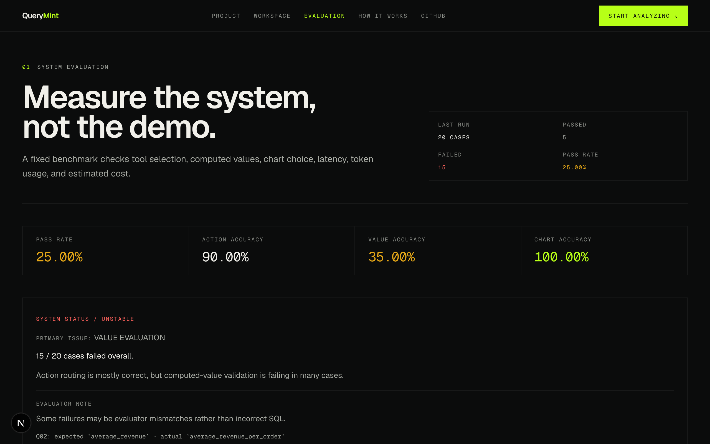
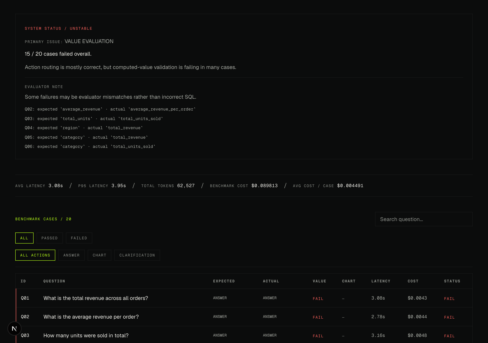

# QueryMint


## 📸 Screenshots & Visual Tour

|  |  |
|---|---|
| **Landing Hero & Architecture Overview** | **Interactive Dataset Workspace & Profiling** |

|  |  |
|---|---|
| **Evaluation Metrics & Benchmarks** | **Detailed Case Inspector & SQL Execution Logs** |


## Current phase

Phase 1 implements:

- CSV upload
- upload validation
- dataset storage
- automatic dataset profiling
- DuckDB type inspection
- dataset listing
- dataset preview
- dataset deletion

OpenAI tool calling and query execution will be added in later phases.

## Requirements

- Python 3.12, 3.13 or 3.14
- uv package manager
- OpenAI API key for later phases

## Setup

Create the project environment:

```bash
uv sync