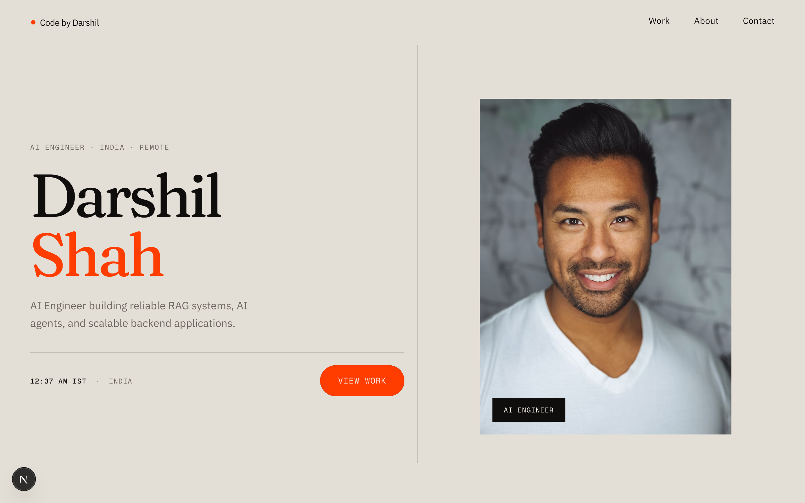
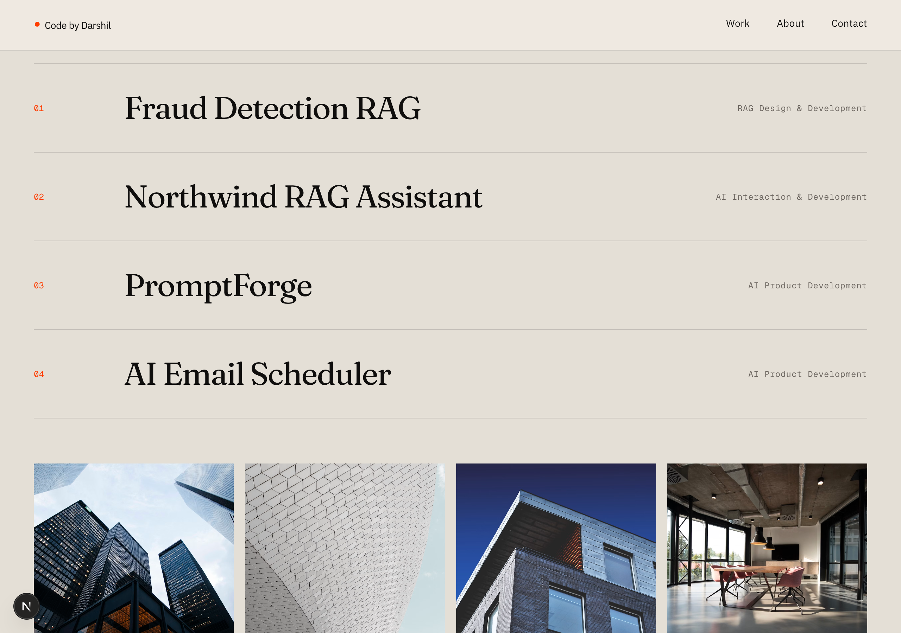
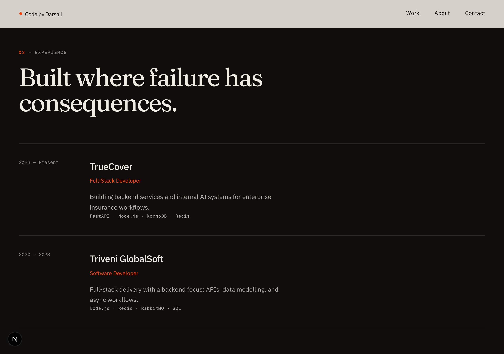
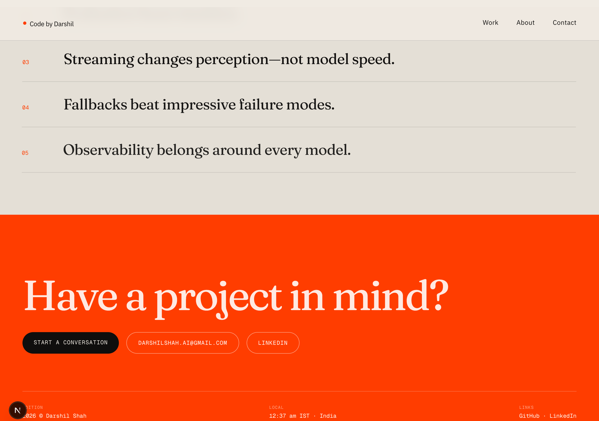

# Darshil Shah — AI Engineer Portfolio

An editorial, brutalist-leaning dark portfolio for an AI Engineer: near-black `#0a0a0a` with a single acid-lime accent `#c8ff32`, oversized Helvetica display type with Georgia-italic accent words, Geist Mono micro-labels, a film-grain overlay, an inverted paper-toned Projects section, and an all-acid Contact section. Built with Next.js 15 (App Router), TypeScript, Tailwind CSS v4 (preflight) + a hand-written design system in `globals.css`, and Framer Motion. All content is data-driven from `src/data/`.
## 📸 Screenshots & Visual Tour

|  |  |
|---|---|
| **Acid-lime brutalist hero with status & IST clock** | **Inverted paper-toned projects showcase** |

|  |  |
|---|---|
| **Interactive live system map & architecture sequence** | **Skills marquee & acid contact section** |

## Stack

- **Next.js 15** — App Router, server components by default
- **TypeScript** — strict mode
- **Tailwind CSS v4** — preflight/reset; the design system itself is custom CSS in `src/app/globals.css` (tokens: `--bg`, `--ink`, `--muted`, `--line`, `--acid`)
- **Framer Motion** — nav slide-in, masked title reveal, "live system map" pipeline sequence, scroll reveals
- **Geist Mono** via `next/font` — all mono labels; body text is intentionally Arial/Helvetica
- **Lucide React** — icons (tree-shaken)
- **Zod** — contact form validation (shared between client and API route)

Signature details: typewriter availability status, live IST clock in the hero meta row, sequenced pipeline nodes with travelling pulses and checkmarks, infinite skills marquee, and standalone case-study pages with numbered system-flow diagrams.

## Getting started

```bash
npm install
npm run dev
```

Open http://localhost:3000.

Production build:

```bash
npm run build
npm start
```

## Environment variables

Copy `.env.example` to `.env.local`:

| Variable | Required | Purpose |
| --- | --- | --- |
| `NEXT_PUBLIC_SITE_URL` | Recommended | Canonical URL for metadata, sitemap, Open Graph |
| `RESEND_API_KEY` | Optional | Contact form email delivery via Resend. Without it, submissions are logged to the server console and still succeed |
| `CONTACT_TO_EMAIL` | Optional | Where contact messages are delivered |
| `CONTACT_FROM_EMAIL` | Optional | Verified Resend sender |

## Deploying to Vercel

1. Push this repository to GitHub.
2. Import it at [vercel.com/new](https://vercel.com/new) — the Next.js defaults are correct.
3. Add the environment variables above in Project Settings → Environment Variables.
4. Deploy. The sitemap (`/sitemap.xml`), robots (`/robots.txt`), and Open Graph image are generated automatically.

## Customising content

Everything editable lives in `src/data/`:

| File | Contents |
| --- | --- |
| `src/data/site.ts` | Name, headline, email, GitHub/LinkedIn URLs, availability line, meta title/description |
| `src/data/projects.ts` | All six projects, including full case-study content and architecture diagrams |
| `src/data/experience.ts` | Roles, periods, bullets, stack tags |
| `src/data/skills.ts` | Skill groups and their items |
| `src/data/articles.ts` | Writing section — add an `href` to make a card clickable |

### Placeholders to replace before going live

- [ ] **GitHub / LinkedIn URLs** in `src/data/site.ts` (currently guesses)
- [ ] **GitHub repo URLs** on each project in `src/data/projects.ts`
- [ ] **Experience date ranges** in `src/data/experience.ts` (marked as placeholders)
- [ ] **`public/resume.pdf`** — replace the placeholder with the real resume
- [ ] **Results bullets** in projects — swap qualitative placeholders for measured numbers where you have them
- [ ] **`NEXT_PUBLIC_SITE_URL`** — set to the real domain
- [ ] Add `href` values in `src/data/articles.ts` as articles get published

### Adding a project

Add one object to the array in `src/data/projects.ts`. The card, the case-study page at `/projects/<slug>`, and the sitemap entry are all generated from it. The `architecture` array renders the responsive flow diagram; `snippet` is optional.

## Architecture notes

- **Server components by default** — only animation and interaction files are client components (`navbar`, `contact-form`, `hero-pipeline`, and the `motion/` primitives).
- **Animations** respect `prefers-reduced-motion` everywhere via Framer Motion's `useReducedMotion`.
- **Contact API** (`src/app/api/contact/route.ts`) validates with the same Zod schema as the client, includes a honeypot field and a light in-memory rate limit, and degrades gracefully when Resend is not configured.
- **SEO** — metadata + Open Graph in `src/lib/metadata.ts`, generated OG image, sitemap, robots, JSON-LD (`Person` in the layout, `SoftwareApplication` per project).

## Testing checklist

- [ ] `npm run build` passes with no TypeScript errors
- [ ] All six project pages render (`/projects/fraud-detection-rag`, etc.)
- [ ] Contact form: validation errors, loading state, success state
- [ ] Mobile: navigation drawer opens/closes, no horizontal overflow
- [ ] Keyboard: tab through nav, skip link appears, form is fully operable
- [ ] Reduced motion: enable "Reduce motion" in OS settings — page stays readable with animations minimised
- [ ] Lighthouse: Performance / Accessibility / SEO ≥ 90
