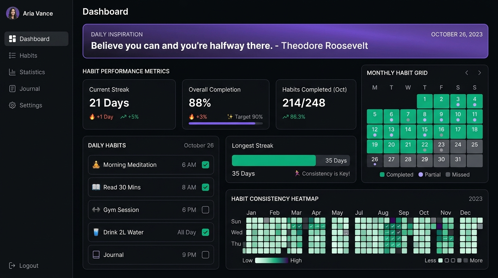
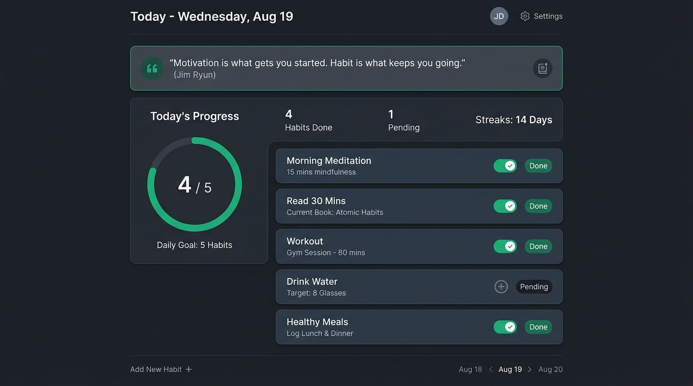
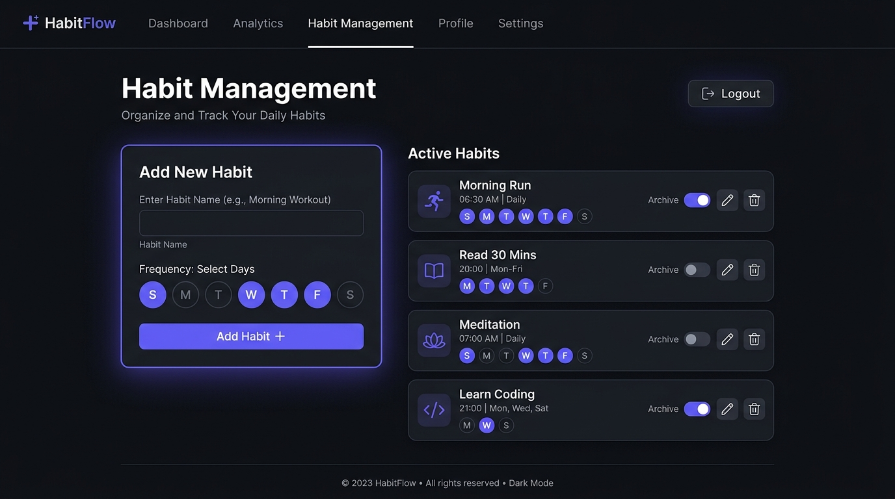
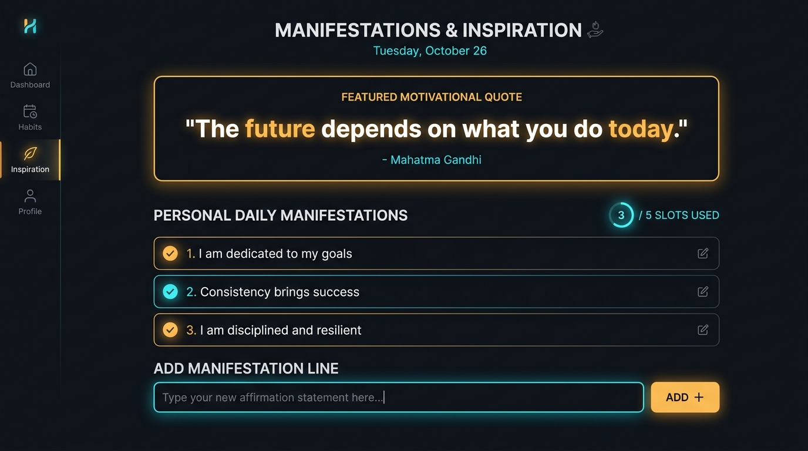
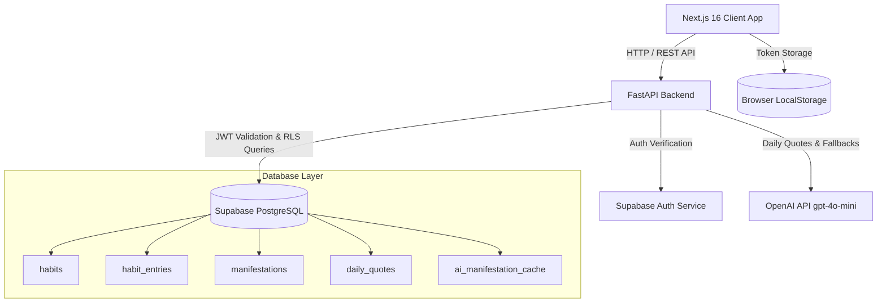

# 🌟 Habit Tracker — Full-Stack Application

A modern, minimal, dark-mode **Habit Tracker** designed to help users build consistency through daily check-ins, monthly performance matrices, contribution heatmaps, and AI-powered motivational inspiration.

Built with **Next.js 16**, **React 19**, **Tailwind CSS 4**, **FastAPI**, **Supabase PostgreSQL**, and **OpenAI**.

---

## 📸 Visual Tour & Screenshots

| **Dashboard & Performance Heatmap** | **Daily Check-In (Today View)** |
|:---:|:---:|
|  |  |
| *Monthly completion matrix, overall streak metrics, and GitHub-style consistency heatmaps.* | *Daily check-in checklist with status toggles, progress ring, and daily inspiration banner.* |

| **Habit Schedule Management** | **Manifestations & AI Inspiration** |
|:---:|:---:|
|  |  |
| *Custom weekday schedule picker (`0=Sun`...`6=Sat`), active & archived habit management.* | *Daily quote, personal manifestation lines (max 5), and AI fallback inspiration.* |

---

## ✨ Features

### 🔑 Authentication & Security
- **Supabase Auth Integration**: Email and password authentication yielding Supabase JWTs.
- **Session Persistence**: Automatic token storage in browser local storage (`habit-tracker:auth`) and header injection (`Authorization: Bearer <token>`).
- **Row Level Security (RLS)**: Enforced directly in PostgreSQL so users can strictly access only their own habits, entries, and manifestations.

### 📅 Habit Management & Scheduling
- **Custom Weekday Schedules**: Select specific days of the week (`[0, 1, 2, 3, 4, 5, 6]`) for each habit.
- **Active & Archive States**: Archive past habits without deleting historical logs.
- **Cascading Deletes**: Clean deletion of associated daily entries upon habit deletion.

### ✅ Daily Check-Ins & Logging
- **Instant Status Upsert**: Toggle habit statuses between `done`, `not_done`, or `null` (clear entry).
- **Strict 7-Day Edit Window**: Entries can only be logged or modified for **today and the past 7 days**. Prevents invalid historical retroactive edits at both frontend and API levels.

### 📊 Analytics & Visualizations
- **Monthly Matrix View**: Grid showing daily status per habit across the entire calendar month.
- **Contribution Heatmap**: GitHub-style activity heatmaps showing habit consistency over time.
- **Streak & Performance Counters**: Real-time streak tracking and overall completion percentage.

### 🧘 Mindset, Manifestations & AI Inspiration
- **Attributed Daily Quotes**: Daily real-person quotes fetched via OpenAI (`gpt-4o-mini`), cached in PostgreSQL per calendar day.
- **Personal Manifestations**: Up to **5 custom affirmation lines** per user, enforced via API logic & PostgreSQL database triggers (`enforce_manifestation_limit`).
- **AI Fallback Lines**: When custom user manifestations aren't set, the system dynamically generates 3 AI mindset statements cached daily per user.

---

## 🛠️ Technology Stack

| Layer | Technology | Details |
| :--- | :--- | :--- |
| **Frontend Framework** | Next.js 16 (App Router), React 19 | Server & Client Components, TypeScript |
| **Frontend Styling** | Tailwind CSS 4, Lucide Icons | Dark Mode, Custom Design System |
| **Backend API** | FastAPI (Python 3.10+) | Uvicorn, Pydantic v2 validation |
| **Database & Auth** | Supabase PostgreSQL, Supabase Auth | RLS policies, PL/pgSQL triggers, `supabase-py` client |
| **AI / LLM** | OpenAI API (`gpt-4o-mini`) | Attributed quotes and daily mindset generation |

---

## 🏗️ Project Architecture



---

## 📁 Repository Structure

```
habit-tracker/
├── assets/
│   └── screenshots/              # Screenshot images used in documentation
│       ├── dashboard_preview.jpg
│       ├── today_view.jpg
│       ├── habits_management.jpg
│       └── manifestations_view.jpg
├── backend/                      # FastAPI Python backend
│   ├── app/
│   │   ├── db/                   # Supabase client setup
│   │   ├── routers/              # Auth, habits, entries, manifestations, inspiration routes
│   │   ├── schemas/              # Pydantic request/response schemas
│   │   ├── services/             # OpenAI quote & manifestation generator
│   │   ├── config.py             # Environment configurations
│   │   ├── deps.py               # Authentication dependencies
│   │   └── main.py               # FastAPI entry point & CORS configuration
│   ├── sql/
│   │   └── 001_schema.sql        # Supabase database DDL, RLS policies & triggers
│   ├── .env.example              # Example backend environment configuration
│   ├── pyproject.toml            # Dependencies and build settings
│   ├── requirements.txt          # Python requirements
│   └── README.md                 # Backend specific README
├── frontend/                     # Next.js 16 frontend application
│   ├── app/                      # Next.js App Router (pages: today, dashboard, habits, manifestations)
│   ├── components/               # Reusable UI components (AppShell, Heatmaps, Matrices, Forms)
│   ├── context/                  # React HabitStore context over REST API
│   ├── lib/                      # API client functions, date helpers, types
│   ├── .env.local.example        # Example frontend environment configuration
│   ├── package.json              # Node.js dependencies & scripts
│   └── README.md                 # Frontend specific README
└── README.md                     # Root project documentation
```

---

## 🚀 How to Run the Project

### Prerequisites
- **Node.js**: v18.0.0 or higher
- **Python**: v3.10 or higher
- **Supabase Account**: A free project at [supabase.com](https://supabase.com)
- **OpenAI API Key**: Key with access to `gpt-4o-mini`

---

### Step 1: Database Setup (Supabase)

1. Log into your [Supabase Dashboard](https://supabase.com) and create a new project.
2. Open the **SQL Editor** in the Supabase Dashboard.
3. Paste and run the complete contents of [`backend/sql/001_schema.sql`](./backend/sql/001_schema.sql).
   *(This creates tables, indexes, RLS security policies, and the PL/pgSQL trigger for manifestation line limits).*
4. Navigate to **Project Settings → API** and copy:
   - **Project URL** (`SUPABASE_URL`)
   - **`anon` `public` key** (`SUPABASE_ANON_KEY`)
   - **`service_role` key** (`SUPABASE_SERVICE_ROLE_KEY`)
5. Navigate to **Authentication → Providers → Email** and turn **OFF** "Confirm email" (for local testing convenience).

---

### Step 2: Backend Setup

1. Navigate to the `backend` directory:
   ```bash
   cd backend
   ```

2. Create a `.env` file from `.env.example`:
   ```bash
   cp .env.example .env
   ```

3. Fill in your environment variables in `.env`:
   ```env
   SUPABASE_URL=https://your-project.supabase.co
   SUPABASE_ANON_KEY=your-anon-key
   SUPABASE_SERVICE_ROLE_KEY=your-service-role-key
   OPENAI_API_KEY=sk-proj-your-openai-key
   OPENAI_MODEL=gpt-4o-mini
   CORS_ORIGINS=http://localhost:3000
   ```

4. Create virtual environment and install dependencies:
   ```bash
   python3 -m venv .venv
   source .venv/bin/activate    # On Windows: .venv\Scripts\activate
   pip install -r requirements.txt
   ```

5. Start the FastAPI development server:
   ```bash
   uvicorn app.main:app --reload --port 8000
   ```

   - **API Server**: [http://localhost:8000](http://localhost:8000)
   - **Interactive API Docs (Swagger UI)**: [http://localhost:8000/docs](http://localhost:8000/docs)
   - **Health Check**: [http://localhost:8000/health](http://localhost:8000/health)

---

### Step 3: Frontend Setup

1. Open a new terminal tab and navigate to the `frontend` directory:
   ```bash
   cd frontend
   ```

2. Create a `.env.local` file from `.env.local.example`:
   ```bash
   cp .env.local.example .env.local
   ```

3. Ensure `.env.local` points to your backend server:
   ```env
   NEXT_PUBLIC_API_URL=http://localhost:8000
   ```

4. Install Node modules:
   ```bash
   npm install
   ```

5. Start the Next.js development server:
   ```bash
   npm run dev
   ```

6. Open your browser and navigate to [http://localhost:3000](http://localhost:3000).

---

## 📡 API Reference Summary

All protected endpoints require an `Authorization: Bearer <access_token>` header.

### 🔑 Auth (`/auth`)
| Method | Endpoint | Description |
| :--- | :--- | :--- |
| `POST` | `/auth/signup` | Register a new user with email & password |
| `POST` | `/auth/signin` | Sign in user and receive JWT access token |
| `POST` | `/auth/signout` | Invalidate session |
| `GET` | `/auth/me` | Fetch currently authenticated user profile |

### 📅 Habits (`/habits`)
| Method | Endpoint | Description |
| :--- | :--- | :--- |
| `GET` | `/habits?archived=false` | Retrieve user habits list |
| `POST` | `/habits` | Create a habit (`name`, `daysOfWeek`) |
| `PATCH` | `/habits/{id}` | Update habit name, days, or archived status |
| `DELETE` | `/habits/{id}` | Delete habit and cascade associated entries |

### ✅ Entries (`/entries`)
| Method | Endpoint | Description |
| :--- | :--- | :--- |
| `GET` | `/entries?from=YYYY-MM-DD&to=YYYY-MM-DD` | Get entries in date range |
| `PUT` | `/entries` | Upsert daily status (`done` \| `not_done` \| `null`) |

### 🧘 Manifestations (`/manifestations`)
| Method | Endpoint | Description |
| :--- | :--- | :--- |
| `GET` | `/manifestations` | Get user custom manifestation lines (max 5) |
| `POST` | `/manifestations` | Create a manifestation line |
| `PATCH` | `/manifestations/{id}` | Edit a manifestation line |
| `DELETE` | `/manifestations/{id}` | Delete a manifestation line |

### 💡 Inspiration (`/inspiration`)
| Method | Endpoint | Description |
| :--- | :--- | :--- |
| `GET` | `/inspiration/today` | Fetch daily quote & manifestation lines (User or AI) |

---

## 🧪 Smoke Test (CLI Verification)

You can verify the backend directly using `curl`:

```bash
# 1. Sign up a test user
curl -s -X POST http://localhost:8000/auth/signup \
  -H 'Content-Type: application/json' \
  -d '{"email":"test@example.com","password":"Password123!"}'

# 2. Extract the accessToken from response, then set TOKEN env var
export TOKEN=eyJhbGciOiJIUzI1NiIsInR5cCI6IkpXVCJ9...

# 3. Create a daily habit
curl -s -X POST http://localhost:8000/habits \
  -H "Authorization: Bearer $TOKEN" \
  -H 'Content-Type: application/json' \
  -d '{"name":"Morning Meditation","daysOfWeek":[0,1,2,3,4,5,6]}'

# 4. Fetch daily inspiration
curl -s http://localhost:8000/inspiration/today \
  -H "Authorization: Bearer $TOKEN"
```

---

## 📜 License

Distributed under the MIT License. See `LICENSE` for details.
