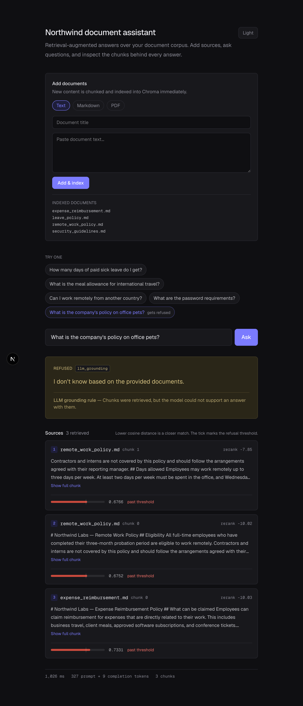
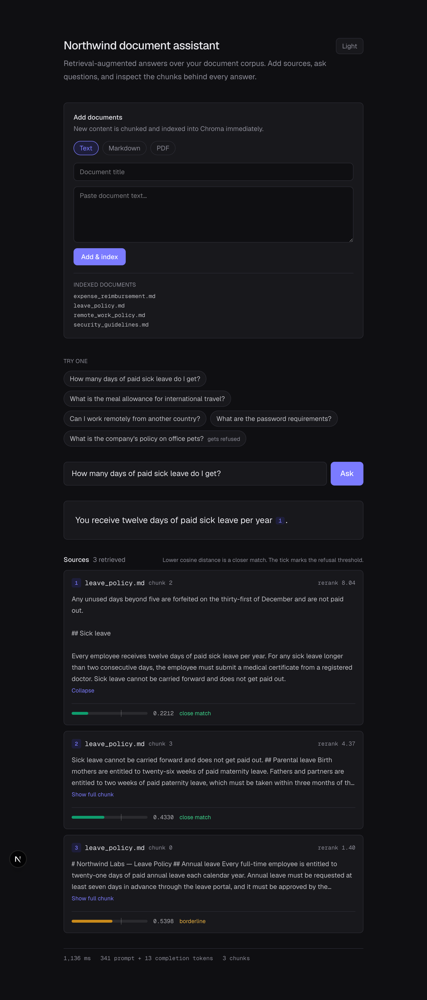
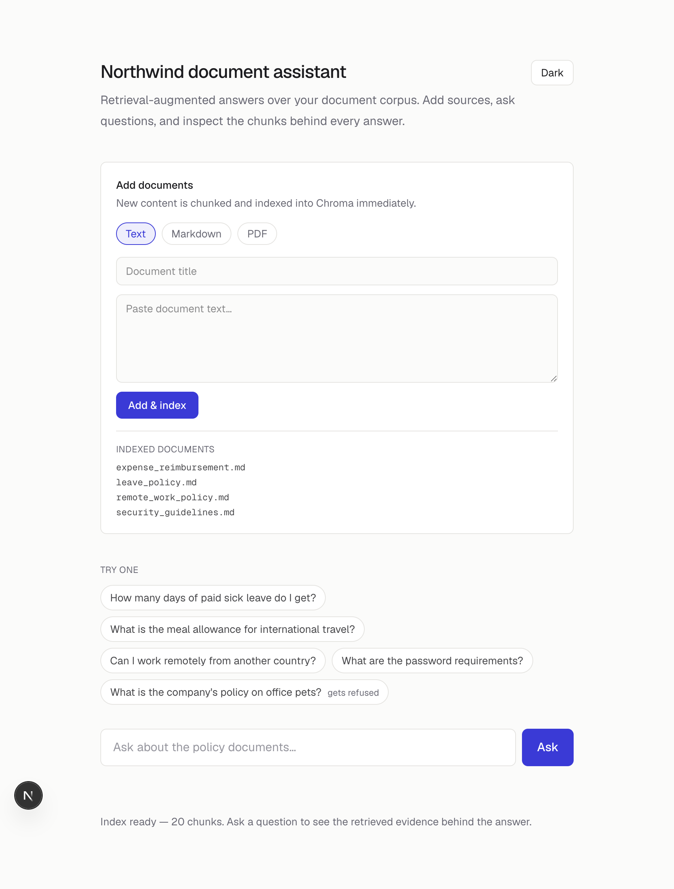
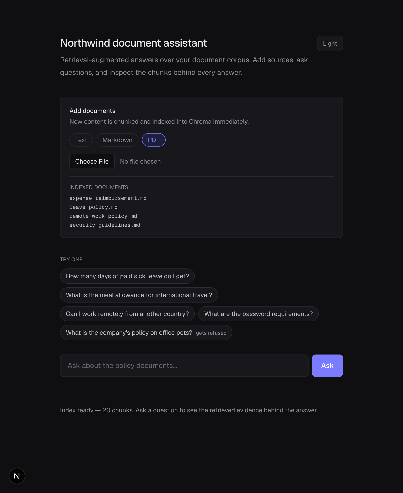
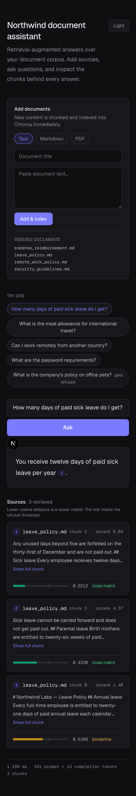

# Northwind RAG — Smart Document Assistant

A retrieval-augmented question answering system over a company document
corpus. Answers cite their source chunks, refuse when the documents do not
contain the fact, and expose the full retrieval trail — distances, rerank
scores, latency, and token usage.

**Backend:** Python, FastAPI, Chroma, `all-MiniLM-L6-v2` (embeddings),
`ms-marco-MiniLM-L-6-v2` (reranker), GPT-4o-mini (generation).

**Frontend:** Next.js (App Router), TypeScript, Tailwind CSS.

**Live demo:** not deployed yet — run locally (see Quick start). A hosted
version would need a lighter embedding strategy: `sentence-transformers`
pulls PyTorch (~2 GB), which exceeds most free-tier hosts. A production
deploy would likely swap to an API-based embedding model and note the
trade-off in the README.

---

## Features

### Question answering
- Ask natural-language questions against the indexed corpus
- Every answer shows the retrieved source chunks it was built from
- Inline citation buttons jump to the matching source card
- Two-gate refusal: distance threshold (pre-LLM) and LLM grounding rule
- Footer shows latency (ms) and prompt/completion token counts per query
- Example question chips, including one that triggers a refusal

### Document ingestion
- Add documents from the UI in three formats:
  - **Text** — paste a title and body (saved as `.md`)
  - **Markdown** — upload a `.md` file
  - **PDF** — upload a `.pdf` file (text extracted via `pypdf`)
- New content is chunked and indexed into Chroma **immediately**
- Indexed document list updates after each upload
- Re-uploading the same filename replaces the old chunks

### UI
- Dark theme by default; light/dark toggle with persisted preference
- Mobile-friendly single-column layout
- Backend health check with clear “unreachable” state
- Handles empty input, network errors, and API failures

---

## Screenshots

<p align="center">
  
</p>

<p align="center"><em>Home — document upload, indexed corpus, and question input (dark theme)</em></p>

<br />

<p align="center">
  
</p>

<p align="center"><em>Grounded answer — inline citations, source cards, distance bars, rerank scores, latency &amp; tokens</em></p>

<br />

<p align="center">
  
</p>

<p align="center"><em>Refusal — muted warning styling with gate label (<code>distance_threshold</code> or <code>llm_grounding</code>)</em></p>

<br />

<p align="center">
  
</p>

<p align="center"><em>Expanded chunk — full retrieved text and cosine distance bar with refusal threshold marker</em></p>

<br />

<table>
  <tr>
    <td align="center" width="50%">
      <br />
      <em>Light theme</em>
    </td>
    <td align="center" width="50%">
      <br />
      <em>Document upload — Text / Markdown / PDF tabs</em>
    </td>
  </tr>
  <tr>
    <td align="center" colspan="2">
      <br />
      <em>Mobile — single-column responsive layout</em>
    </td>
  </tr>
</table>

> To regenerate screenshots locally, start both servers then run:
> `node .verify/capture-screenshots.mjs` from the `.verify/` directory
> (requires Playwright Chromium).

---

## Quick start

### Prerequisites
- Python 3.13+
- Node.js 20+
- An OpenAI API key in `.env`:
  ```
  OPENAI_API_KEY=sk-...
  ```

### 1. Backend

```bash
# from project root
uv sync
uvicorn main:app --reload
```

API runs at `http://localhost:8000`.

### 2. Build the initial index (first run only)

If `chroma_db/` is empty or missing:

```bash
python -m scripts.build_index
```

This reads markdown files from `sample_docs/`, chunks them, embeds them,
and stores vectors in Chroma.

### 3. Frontend

```bash
cd frontend
npm install
npm run dev
```

UI runs at `http://localhost:3000`.

Optional: set `NEXT_PUBLIC_API_BASE_URL` in `frontend/.env.local` if the
backend is not on `http://localhost:8000`.

---

## Project structure

```
northwind-rag/
├── app/
│   ├── api.py              # FastAPI routes
│   ├── config.py           # Settings (thresholds, model names, paths)
│   ├── models.py           # Request/response schemas
│   └── rag/
│       ├── chunking.py     # Paragraph-based chunking
│       ├── ingest.py       # Runtime document ingestion
│       ├── pipeline.py     # retrieve → gate → rerank → generate
│       ├── rerank.py       # Cross-encoder reranker
│       └── store.py        # Chroma + embedding model
├── eval/
│   └── evaluate.py         # Retrieval/refusal eval harness
├── frontend/               # Next.js UI
├── sample_docs/            # Source documents on disk
├── scripts/
│   └── build_index.py      # Batch index builder
├── chroma_db/              # Persistent vector store
└── main.py                 # FastAPI entry point
```

---

## API

| Method | Path | Description |
|--------|------|-------------|
| `GET` | `/api/health` | `{ status, chunks }` |
| `POST` | `/api/ask` | `{ question }` → answer, sources, `gate_distance`, usage, latency |
| `GET` | `/api/documents` | List indexed source filenames + total chunk count |
| `POST` | `/api/documents/text` | `{ title, text }` → index a pasted document |
| `POST` | `/api/documents/upload` | `multipart/form-data` with `file` (`.md` or `.pdf`) |

### Example — ask

```bash
curl -s -X POST http://localhost:8000/api/ask \
  -H 'Content-Type: application/json' \
  -d '{"question":"How many days of paid sick leave do I get?"}'
```

### Example — add document via text

```bash
curl -s -X POST http://localhost:8000/api/documents/text \
  -H 'Content-Type: application/json' \
  -d '{"title":"team_norms","text":"All team meetings start at 9:00 AM."}'
```

---

## How it works

### Chunking strategy

**Approach:** paragraph-based chunking, target size 500 characters, with
single-sentence overlap between consecutive chunks.

Headings are merged with the paragraph beneath them so a heading never
sits alone at a chunk boundary. Overlap carries the last *sentence* of the
previous chunk, not the last paragraph (which was often just a bare
`## Heading`).

| Target size | Result |
|---|---|
| 250 | Too small — related facts separated across chunks |
| 500 | Best fit — one complete section per chunk |
| 1000 | Too large — unrelated topics merged |

### Two-gate answerability

**Gate 1 — distance threshold (before the LLM call).** If the nearest
chunk's cosine distance exceeds `MAX_DISTANCE` (0.65), the system refuses
immediately without spending tokens.

**Gate 2 — LLM grounding rule.** The system prompt instructs the model to
answer only from provided chunks and reply *"I don't know based on the
provided documents"* otherwise.

Gate 1 catches wrong-topic queries. Gate 2 catches right-topic queries
where the specific fact is absent. Neither alone is sufficient.

**UI note:** Gate 1 checks the closest of the top-10 *pre-rerank*
chunks (`gate_distance` in the API response). The source cards show the
top-3 *post-rerank* chunks sent to the LLM — so a refusal by
`llm_grounding` can display sources that all look past threshold even
though Gate 1 passed on a closer chunk that reranking dropped.

### Pipeline

```
question → embed → retrieve top 10 → distance gate → rerank to top 3
         → LLM with grounded prompt → answer + sources
```

Embedding and reranker models load once at startup, not per request.

---

## Key findings (measured)

### Distance thresholds cannot detect missing facts

| Question | Top-1 distance | Answerable? |
|---|---|---|
| "What is the meal allowance for international travel?" | 0.411 | **No** |
| "How much annual leave do I get?" | 0.458 | Yes |

Topical similarity ≠ factual presence. This is why Gate 2 is required.

### Wording sensitivity

The same fact asked three ways produced very different distances (0.443 –
0.549). The threshold was loosened from 0.50 to 0.65 to reduce false
refusals; Gate 2 catches cases that slip through.

### Reranking on this dataset

Reranking did not change chunk ordering on this corpus. **Measured, not
assumed.** Retained for larger corpora where rank 3–10 chunks may need
reordering.

---

## Security (demo scope)

Runtime document ingestion is **unauthenticated** in this demo. Uploaded
text goes straight into the LLM prompt, so a malicious document could
attempt prompt injection ("ignore previous instructions…"). Uploads are
limited to 5 MB, restricted to `.md`/`.pdf`, and validated by file
content (PDF magic bytes, UTF-8 text for markdown) — not extension alone.
A production version would need authentication, per-user corpora, content
sanitisation, and injection defences.

---

## Evaluation

**Test set:** 14 questions — answerable (9), hard negatives (2), out of
scope (2), plus paraphrase variants.

**Metric:** expected source file appears in retrieved chunks and the
system does not refuse; or, for unanswerable questions, the system
refuses.

**Result: 14/14** on this test set — measured against the four documents
in `sample_docs/` (~20 chunks). **Adding documents at runtime changes the
corpus and invalidates these numbers.** The 0.65 distance threshold was
calibrated on this same corpus and would need re-tuning on another.

Run locally (with only `sample_docs/` indexed):

```bash
python -m eval.evaluate
```

### Limitations
- Small, author-written test set; valid only for the original four documents
- Runtime uploads change retrieval behaviour and refusal outcomes
- Refusal detected by substring match on "I don't know"
- Retrieval scored at file level, not chunk level
- Threshold tuned on this corpus, not transferable without remeasurement

---

## What I would do next

- Deploy backend (Railway/Render) + frontend (Vercel) with API-based embeddings
- Structured refusal flag instead of string matching
- Chunk-level retrieval scoring in eval
- Hybrid search (keyword + vector) to reduce wording sensitivity
- Document deletion from the UI; auth and injection defences for uploads
- Expand eval with questions from users who have not read the documents
